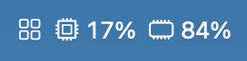
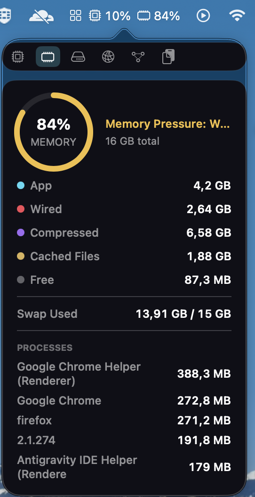
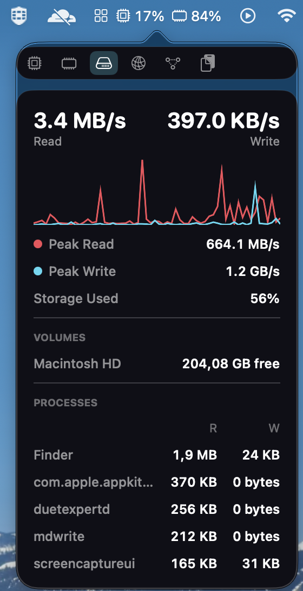
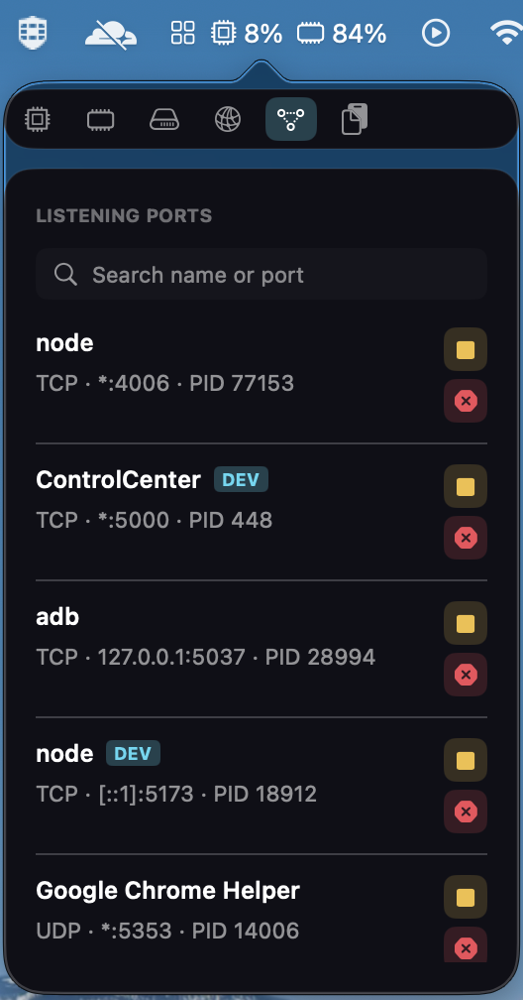
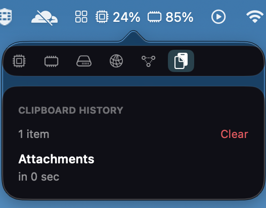

# mStats

A native macOS menu bar system monitor, inspired by [iStat Menus](https://bjango.com/mac/istatmenus/). Each enabled module gets its own live-updating menu bar icon; clicking it opens a dark, card-based dropdown with the full detail.

<p align="center"></p>

## Features

- 🧠 **CPU** — user/system usage, efficiency vs. performance core split (Apple Silicon), top processes.
- 🧮 **Memory** — App / Wired / Compressed / Cached Files / Free breakdown, memory pressure, swap, top processes.
- 💾 **Disk** — per-volume free/used space, live read/write throughput, top processes by disk I/O.
- 🌐 **Network** — live upload/download throughput, connection type, optional public IP lookup (off by default).
- 🌡️ **Sensors** — CPU/GPU/battery temperature, fan RPM (via SMC).
- 🔋 **Battery** — charge %, health %, cycle count, time remaining.
- 🔌 **Ports** — listening TCP/UDP ports with process/PID, search by name or port, stop (SIGTERM) or force-kill (SIGKILL).
- 🐳 **Docker** — running/stopped containers with live CPU & memory, start/stop/restart, auto-detects whether the daemon is running.
- 📋 **Clipboard History** — recent copies with one-click copy-back, global `⌘⇧V` shortcut, and automatic skipping of password-manager/concealed items.
- 🧩 **Combined icon mode** — collapse every module into a single tabbed menu bar icon instead of one per module.

## Screenshots

<p align="center">
  
  
  
</p>
<p align="center">
  
</p>

## Requirements

- macOS 14 (Sonoma) or later
- Xcode 16+ / Swift 6

## Building

```bash
brew install xcodegen   # one-time
xcodegen generate
xcodebuild -project mStats.xcodeproj -scheme mStats -configuration Debug \
  CODE_SIGNING_ALLOWED=NO CODE_SIGNING_REQUIRED=NO CODE_SIGN_IDENTITY="" build
open build/Build/Products/Debug/mStats.app
```

Run the package's unit tests directly:

```bash
cd Packages/mStatsKit && swift test
```

## Project structure

```
mStats/
├── project.yml                 # xcodegen project definition
├── Sources/mStatsApp/          # thin app target (menu bar shell, entitlements)
└── Packages/mStatsKit/         # all app logic as a local Swift package
    └── Sources/mStatsKit/
        ├── Engine/              # shared polling engine, process snapshot cache
        ├── Modules/             # one folder per module (provider, view model, card view)
        ├── DesignSystem/        # shared card/ring/sparkline/legend components
        └── Settings/            # preferences UI
```

See [`PRD/PRD.md`](PRD/PRD.md) for the full product spec, architecture notes, and roadmap.

## Status

Early development. All modules above (CPU/Memory/Disk/Network/Sensors/Battery/Ports/Docker/Clipboard History) are functional. Clock, Weather, and Calendar modules, code signing/notarization, and Mac App Store distribution are not yet implemented.

## License

MIT — see [LICENSE](LICENSE).
